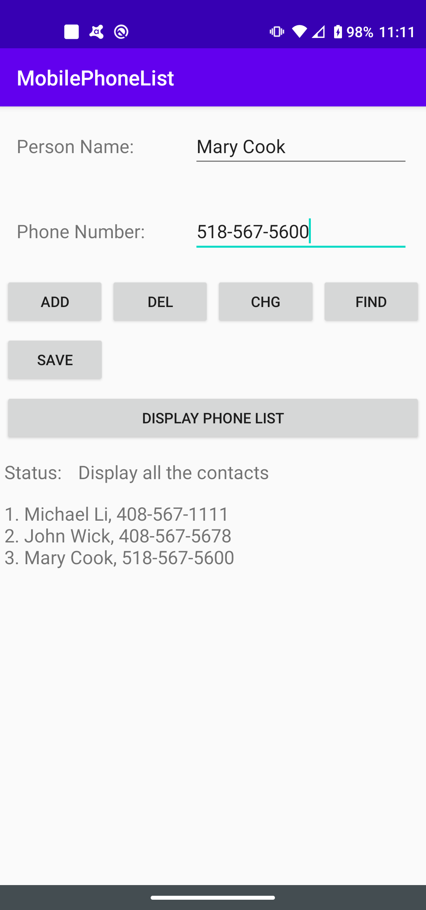

# Android_App_MobilePhoneList
Mobile Phone Contact List App for Android

## Android_App_WeightConverter

### Description
The app is to store the user's phone contact list.  The user can add, remove, and update any contact record in the list.  The list can be saved.   Whenever the app is re-started by the user, the saved list in the file will initially be retrieved.  There is a status text box to confirm whether the user's command such as add is carried successfully.

### Requirements
SDK: Android 4.2 (Jelly Bean) API 17\
Tool: Android Studio 4.0.1\
Language: Java

### Test device
Tested device: Motorola G Power (2010)  OS Android 10.0 (Android Q)

### Usage Instruction
Step 1: Start the app.  If a previous saved phone list already exists, the app will retrieve and display the saved list.
Step 2: Enter the person's name and phone number for a new contact.  Press the add button.
Step 3: Enter the person's name to search for.   Press the find button.
Step 4. If the find is good, you can change the name and phone number.  Press the change button.
Step 5: Enter the person's name to delecte an existing contact.  Press the delete button.
Step 6: If you like all the changes, press the save button to write the updated list to a file in the app's internal storage.
Step 7: Close the app and restart again.  The saved list should be displayed.

Note: If the button pressed creates an error, the status window will indicate the problem (i.e. The contact is not found.)

